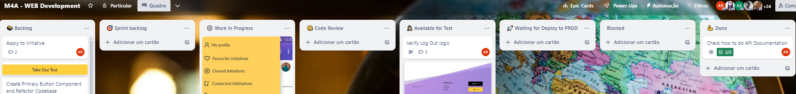

# Welcome to the Match4Action Dev Team!

## Our kanban workflow

🗃️ Backlog: product backlog   
🎯 Sprint backlog: sprint backlog   
⚙️ Work In Progress: features being implemented   
🧐 Code Review: features ready for code review   
🕵️ Available for Test: features ready to be tested on https://match4action.vercel.app/   
🚀 Waiting for Deploy to PROD: features ready to be deployed into production (we don't have a production env yet)   
💪 Done  

## Source Version Control 

We are using GitFlow! 
More about it, check it out: https://danielkummer.github.io/git-flow-cheatsheet/index.html
Our definitions for GitFlow:
- our production branch: **main**
- our develop branch: **development**

When the development branch is updated, the application deployed in the cloud is automatically updated:
https://match4action.vercel.app/

